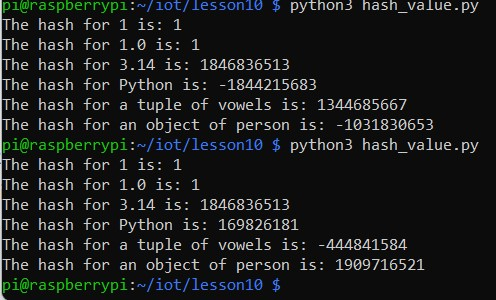
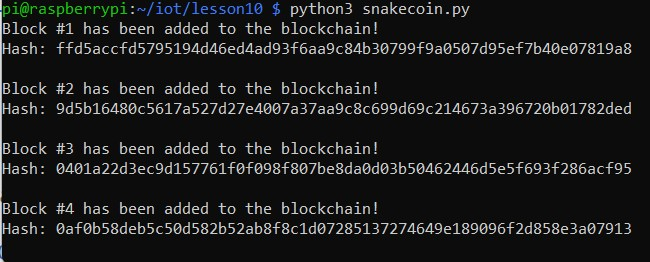
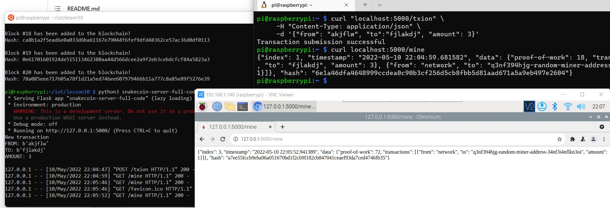
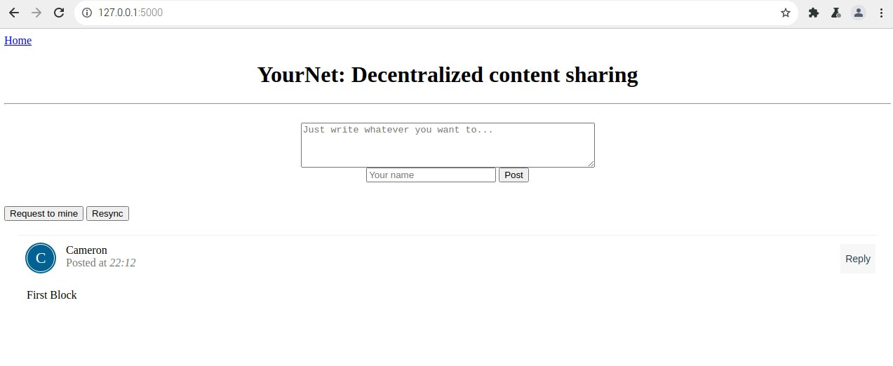
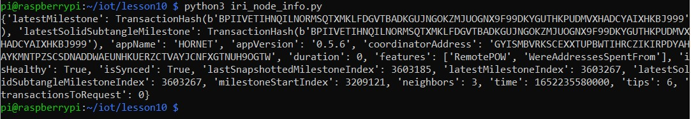

# Lab 10

This lab uses python to experiment with blockchain by creating two small bloackchains an mining on them. It also checks the most recent transaction on the pyOTA blockchain.

hash_value.py:

Snakecoin:

Snakecoin Server:

Python Blockchain App:

pyOTA:

